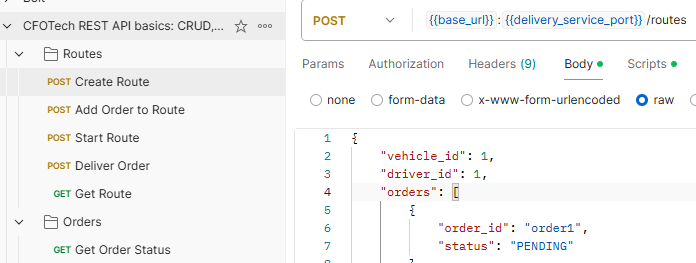

# E-commerce Distribution Microservices

Este proyecto contiene tres microservicios escritos en Go que simulan el flujo de entrega de compras en una plataforma de ecommerce. Incluye:

- **`orders-service`**: Gestiona el estado e historial de las compras.
- **`delivery-service`**: Administra rutas de distribución y publica eventos.
- **`notification-service`**: Escucha eventos desde NATS y simula el envío de notificaciones.
- **`nats`**: Event bus en memoria para comunicación asíncrona entre microservicios.

## 🚀 Cómo ejecutar

### Requisitos

- Docker y Docker Compose instalados.

### Comando para iniciar

```bash
docker-compose up --build
```

Esto compilará y levantará los servicios en:

- **`orders-service`**: [http://localhost:8081](http://localhost:8081)
- **`delivery-service`**: [http://localhost:8082](http://localhost:8082)
- **`notification-service`**: Escucha eventos desde NATS.
- **`nats`**: Disponible en el puerto `4222`.

---

## 🛒 `orders-service`

Servicio de gestión de órdenes de compra para la plataforma de e-commerce.

### 📦 Endpoints REST

#### **GET /orders/{id}/status**
- Retorna el estado actual y el historial de una orden.
- **Ejemplo con cURL**:

```bash
curl -X GET http://localhost:8081/orders/{order_id}/status
```

---

## 🚚 `delivery-service`

Servicio encargado de gestionar rutas de distribución y publicar eventos relacionados con el estado de las órdenes en una plataforma de e-commerce.

### 🚀 Funcionamiento

El `delivery-service` permite:

- Crear rutas de distribución.
- Agregar órdenes a rutas existentes.
- Iniciar rutas, marcando las órdenes como `DISPATCHED`.
- Marcar órdenes específicas como `DELIVERED`.
- Publicar eventos en el bus de eventos (NATS) para sincronización con otros servicios.

---

### 📂 Estructura del proyecto

```
delivery-service/
├── cmd/          # Punto de entrada principal (main.go)
├── internal/     # Lógica de negocio, handlers, servicios y repositorios
├── test/         # Tests unitarios
├── Dockerfile    # Configuración para contenedores
└── Makefile      # Comandos útiles para desarrollo
```

---

### 📦 Endpoints REST
- El archivo `CFOTech REST API basics- CRUD, test & variable.postman_collection` tiene configurado requests para probar todos los endpoints de delivery-service y orders-service.

   

#### **POST /routes**
- Crea una nueva ruta.
- **Body**:

```json
{
    "vehicle_id": 1,
    "driver_id": 1,
    "orders": [
        {
            "order_id": "order1",
            "status": "PENDING"
        },
        {
            "order_id": "order2",
            "status": "PENDING"
        }
    ]
}
```

- **Ejemplo con cURL**:

```bash
curl -X POST http://localhost:8082/routes -H "Content-Type: application/json" -d '{ "vehicle_id": 1, "driver_id": 1, "orders": [ { "order_id": "order1", "status": "PENDING" }, { "order_id": "order2", "status": "PENDING" } ] }'
```

---

#### **POST /routes/{id}/orders**
- Agrega una orden a la ruta y publica un `PENDING` para esa orden.
- **Body**:

```json
{
  "order_id": "order3"
}
```

- **Ejemplo con cURL**:

```bash
curl -X POST http://localhost:8082/routes/route1/orders -H "Content-Type: application/json" -d '{"order_id": "order3"}'
```

---

#### **POST /routes/{id}/start**
- Marca todas las órdenes de la ruta como `DISPATCHED` y publica eventos para cada orden.
- **Ejemplo con cURL**:

```bash
curl -X POST http://localhost:8082/routes/route1/start
```

---

#### **POST /routes/{route_id}/orders/{order_id}/deliver**
- Marca una orden específica como `DELIVERED` y publica un evento.
- **Ejemplo con cURL**:

```bash
curl -X POST http://localhost:8082/routes/route1/orders/order3/deliver
```

---

#### **GET /routes/{id}**
- Obtiene los detalles de la ruta y los estados de las órdenes asociadas.
- **Ejemplo con cURL**:

```bash
curl -X GET http://localhost:8082/routes/route1
```

---

## ✉️ Notificaciones

Servicio encargado de enviar notificaciones por email cuando una compra es despachada o entregada.

El servicio `notification-service` escucha el topic `delivery.events` desde NATS y muestra en consola mensajes como:

```
[NOTIFICATION] Order order123 is now DELIVERED
```

---

## 🧪 Tests

Ejecuta los tests unitarios desde cada servicio. Por ejemplo:

```bash
docker-compose run orders-service go test ./...
docker-compose run delivery-service go test ./...
docker-compose run notification-service go test ./...
```

---

## 📂 Estructura de cada servicio

Cada microservicio sigue una estructura modular:

```
<service-name>/
├── cmd/          # Punto de entrada principal (main.go)
├── internal/     # Lógica de negocio, handlers, servicios y repositorios
├── test/         # Tests unitarios
└── Dockerfile    # Configuración para contenedores
```

---

## 🌟 Características principales

1. **Arquitectura basada en eventos**:
   - Los microservicios se comunican de forma asíncrona a través de NATS.
   - `delivery-service` publica eventos en el topic `delivery.events`.
   - `notification-service` escucha estos eventos y simula el envío de notificaciones.
   - Por prácticidad se definió un solo subject `delivery.events` para todos los eventos en que se envía la order y su nuevo estado. Idealmente deberían ser un topic para cada tipo de evento (`delivery.dispatched`, `delivery.delivered`, etc)

2. **Modularidad**:
   - Cada servicio tiene capas separadas para handlers, lógica de negocio y acceso a datos.

3. **Pruebas unitarias**:
   - Los tests aseguran la calidad del código y cubren casos de éxito y error. (Limitados a handler functions)

4. **Escalabilidad**:
   - Los servicios son independientes y pueden escalarse horizontalmente.

---

## 🛠️ Tecnologías utilizadas

- **Go**: Lenguaje principal para los microservicios.
- **Docker**: Contenedores para cada servicio.
- **Docker Compose**: Orquestación de los servicios.
- **NATS**: Event bus para comunicación asíncrona.
- **Gin**: Framework HTTP para manejar rutas y peticiones.

---
